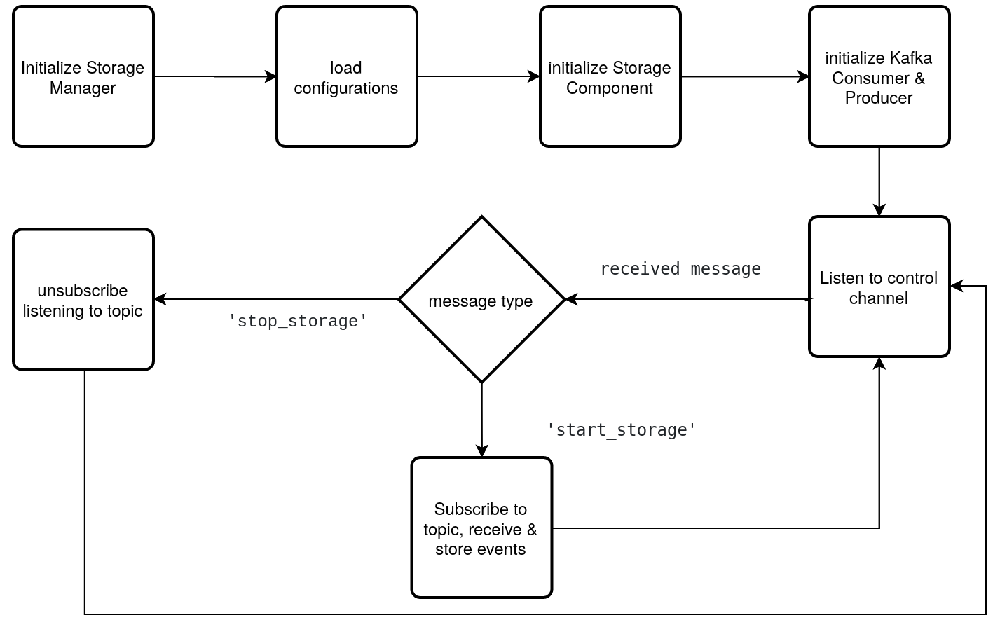

# Component Monitoring
This project is concerned with providing a general, unified and robust approach to monitoring a distributed robotic application. To provide flexibility and extensibility, a general API is provided for controling a distributed monitoring system.

## Usage
Run by specifying the path to a configuration file:
```bash
python3 main.py [config_file_path]
```

Example: `python3 main.py config/component_monitoring_config.yaml`

> **NOTE** that the default value of `[config_file_path]` is `config/component_monitoring_config.yaml`.

## Functional Overview
On a system level, **four** components can be identified that together provide the monitoring functionality in a distributed manner.

## Control Message Format
The components of the component monitoring system communicate with each other via the *Apache Kafka Message Bus*. To start, stop and configure the different parts of the system, so called *control messages* are exchanged via the respective *control channel* on *Kafka*. These messages all follow a general message design of header and body. The gerneral structure of all messages looks as follows:
```json
{
    "from": "monitor_manager",
    "to": "rgbd_camera",
    "message":"response",
    "body": {
        ...
    }
}
```
The `from`, `to` and `message` parameters together form the *header* of the message, while the `body` argument contains an arbitrary message body that depends on the actual *type* of message being sent. The high level *type* of a message is determined by the `message` parameter, while the contents of the *body* determine the fully qualified *type*.
|Parameter|Required|Type                                |Description                                       
|---------|--------|------------------------------------|--------------------------------------------------
|`from`   |True    |string                              |Contains the address of the originating component.
|`to`     |True    |string                              |Contains the address of the receiving component.  
|`message`|True    |enum["response", "request", "info"] |Determines the *type* of the message.             
|`body`   |True    |object                              |The body of the message, its contents depend on the *message type*.

### Request
A **request** contains a `command` and the respective `monitors` that it should be applied for. While generally any component can send requests to any other component, currently this type of message is only transmitted by the *fault tolerant component* to request some particular action from one of the managing components in either the *monitor manager* or the *storage manager*.
```json
{
    "command": "activate",
    "monitors": [
        "pointcloud_monitor"
    ]
}
```
|Parameter |Required|Type                                |Description                                       
|----------|--------|------------------------------------|--------------------------------------------------
|`command` |True    |enum["activate", "shutdown", "start_store", "stop_store"]|The action that is requested by the sender.
|`monitors`|True    |array[string]                       |The IDs of the monitors the action should be applied to.

### Response
A **response** is only send as a reply to a previously received **request**. There is two types of responses, `SUCCESS` and `FAILURE`. Each of them can include additional parameters like `monitors` to return information about the results of a particular command. In the case of failure, the response can contain a `message` field to inform the component about the particular problem that occured on the receiver side.

```json
{
    "body": {
        "code": 200,
        "monitors": [
            {
                "name": "pointcloud_monitor",
                "topic": "pointcloud_monitor_eventbus",
                "exception": "Something bad happened"
            }
        ],
        "message": "Something happened"
}
```
|Parameter |Required|Type                                |Description                                       
|----------|--------|------------------------------------|--------------------------------------------------
|`code`    |True    |integer                             |The response code defining the success of a related request
|`monitors`|False   |array                               |Array of JSON objects containing tupley of `[name, topic]` or `[name, exception]` to inform the receiver about the results of the command execution per monitor. E.g. in the case of an `activate` command it will inform the initiating component about the event topic the monitor is publishing on.
|`message` |False   |string                              |Any message that aids the status code in explaining the success or failure of a request

### Info
An **info** message is send by the transmitting component to inform the receiving component about the occurence of some event that might influence its behaviour.
```json
{
    "body": {
        "monitors": [
            {
                "name": "pointcloud_monitor",
                "message": "Something happened"
            }
        ],
        "message": "Something happened"
}
}
```
|Parameter |Required|Type                                |Description                                       
|----------|--------|------------------------------------|--------------------------------------------------
|`message` |True    |string                              |Any message to be send to the receiver.
|`monitors`|True    |array                               |Tuples of `[name, message]` informing the receiving component about something that happened to a particular monitor.

## Monitor Manager
The **monitor manager** is one of **two** manging components. It is the central entry point of the monitoring application
and controls the individual **monitors**. It is implemented as a python process and only acts upon request via the
*Kafka* control channel. The logic is therefore evolving mainly around the *Kafka consumers* message queue.

Currently the monitor manager is capable of **starting** and **stopping** any monitor that is configured and has a
matching implementation using the provided *base* components, such as the `MonitorBase` class that comprises the basic
functionalities a monitor has to have in order to being managebale and functional in this environment. In the following
its functionalities will be explained in greater detail.

### Start
Upon receiving a valid control message with type `request`, the manager will check the `command` included in the message.
If the command is `activate`, it will expect the `monitors` field to contain a list of strings containing the monitor
*modes* to start for the sending fault tolerant component.
```json
{
    "from": "rgbd_camera",
    "to": "monitor_manager",
    "message": "request",
    "body": {
        "command": "activate",
        "monitors": ["pointcloud_monitor"]
    }
}

```
In this example of such a `START` **request**, the fault tolerant component with the *id* `rgbd_camera` is requesting to
`activate` the monitor with *id* `pointcloud_monitor`. If such a monitor has been configured in the monitoring configuration,
the manager will attempt to create an instance of the respective monitor implementation and start the process.
On instantiation, every monitor creates a unique *event topic*, where it will publish its *event messages* reporting the
*health status* of the monitored component. This event topic is returned on startup to the monitor manager, which collects
it and communicates it to the faul tolerant component requesting the monitoring via a `SUCESS` **response**.
```json
{
    "from": "monitor_manager",
    "to": "rgbd_camera",
    "message": "response",
    "body": {
        "code": 200,
        "monitors": [
            {
                "name": "pointcloud_monitor",
                "topic": "pointcloud_monitor_eventbus",
            }
        ]
    }
}
```
In this example the activation of the monitor succeeded and the `monitor_manager` replies to the `rgbd_camera` with
response code `200`, representing *success* and includes the *id* and *topic* of the monitors it started in the `monitors`
list.

### Stop
Upon receiving a valid control message with type `request`, the manager will check the `command` included in the message.
If the command is `shutdown`, it will expect the `monitors` field to contain a list of strings containing the monitor
*modes* to stop for the sending fault tolerant component.
```json
{
    "from": "rgbd_camera",
    "to": "monitor_manager",
    "message": "request",
    "body": {
        "command": "shutdown",
        "monitors": ["pointcloud_monitor"]
    }
}
```
Upond receiving this example shutdown request, the manager will check the list of active monitors for the *ids* provided
in the `monitors` array and terminate the respective processes. It will then reply with a response, informing the
requesting component whether the shutdown was successful and which monitors were effected like in the example success
response message below.
```json
{
    "from": "monitor_manager",
    "to": "rgbd_camera",
    "message": "response",
    "body": {
        "code": 200,
        "monitors": [
            {
                "name": "pointcloud_monitor"
            }
        ]
    }
}
```

## Storage Manager
The **storage manager** is the second managing component. It holds the connection to the storage backend and is responsible
for enabling and disabling storage for a particular monitor on demand. It does that by subscribing to both the control channel
and the event topics of the monitors that have requested storage. Whenever an event is published on one of the *event topics*
it is subscribed to, it will convert the event message into a database entry of appropriate format and store it. To ease
the load on the database backend, common practices like batch writing are employed.

Like the monitor manager, the storage manager is currently capable of two actions, `start_store` and `stop_store`.
### Start
Upon receiving a valid control message via the *Kafka* message bus, the **storage manager** checks the *type* and if it
is a `request`, it additionally checks if the command is `start_store`. If this is the case, the manager reads the
`monitors` array and subscribes to each *event topic* that is given in the list of monitors.
```json
{
  "from": "rgbd_camera",
  "to": "storage_manager",
  "message": "request",
  "body": {
    "command": "start_store",
    "monitors": [
      {
        "name": "pointcloud_monitor",
        "topic": "rgbd_camera_pointcloud_monitor_eventbus"}
    ]
  }
}
```
In this example message, the `rgbd_camera` *fault tolerant component* is requesting to start storage of the `pointcloud_monitor`
with *event topic* `rgbd_camera_pointcloud_monitor_eventbus`. After successfully subscribing to the topic, the manager
replies to the component with a `SUCCESS` response.
```json
{
  "from": "storage_manager",
  "to": "rgbd_camera",
  "message":"response",
  "body": {
    "code": 200
  }
}
```
### Stop
Upon receiving a valid control message via the *Kafka* message bus, the **storage manager** checks the *type* and if it
is a `request`, it additionally checks if the command is `stop_store`. If this is the case, the manager reads the
`monitors` array and unsubscribes from each *event topic* that is given in the list of monitors.
```json
{
  "from": "rgbd_camera",
  "to": "storage_manager",
  "message": "request",
  "body": {
    "command": "start_store",
    "monitors": [
      {
        "name": "pointcloud_monitor",
        "topic": "rgbd_camera_pointcloud_monitor_eventbus"}
    ]
  }
}
```
In this example message, the `rgbd_camera` *fault tolerant component* is requesting to stop storage of the `pointcloud_monitor`
with *event topic* `rgbd_camera_pointcloud_monitor_eventbus`. After successfully unsubscribing from the topic, the manager
replies to the component with a `SUCCESS` response.
```json
{
  "from": "storage_manager",
  "to": "rgbd_camera",
  "message":"response",
  "body": {
    "code": 200
  }
}
```

## Monitor
We see monitors as functions that get a certain input and produce a component status message as an output, such that we
define these mappings in YAML-based configuration files.

Based on our abstraction, each component is associated with one or more monitors which may be redundant or may look at different aspects of the component; we refer to these monitors as component monitoring *modes*. We classify monitoring modes into different types, in particular:
* `Existence monitors`: Validate the existence of a component (e.g. whether a hardware device is recognised by the host operating system or whether a process is running)
* `Functional monitors`: Validate the operation of a component, namely whether the component satisfies a predefined functional specification

The configuration file for a given component specifies a list of modes and has the following format:

```
component_name: string          [required] -- Component name (snake case should be used
                                              if the name has multiple words)
description: string             [required] -- Monitored component
modes: list<string>             [required] -- A list of path names to component monitor
                                              configuration files
dependencies: list<string>      [optional] -- A list of components on which the component depends
dependency_monitors: dict       [optional] -- For each dependency in "dependencies", specifies
                                              the types and names of the monitors that are
                                              of interest to the component
```

In `modes`, each file defines the input-output mapping mentioned above and has the format shown below:

```yaml
name: string                                            [required] -- Monitor mode name (snake case
                                                                      should be used if the name has
                                                                      multiple words)
description: string                                     [required] -- Monitor mode description
mappings:                                               [required] -- Specifies a list of functional
                                                                      input-output mappings for the
                                                                      monitor mode
    - mapping:
        inputs: list<string>                            [required] -- A list of inputs to the monitor mode
                                                                      (e.g. data variable names)
        outputs:                                        [required] -- A list of monitor outputs
            - output:
                name: string                            [required] -- Output name
                type: string                            [required] -- Output type (allowed types: bool,
                                                                      string, int, double)
                expected: bool | string | int | double  [optional] -- Expected value of the output
        map_outputs: bool                               [optional] -- Specifies whether the mapping outputs
                                                                      should be returned in a map or not
                                                                      (returning them in a map is useful if there
                                                                      may be an unknown number of output copies -
                                                                      e.g. if the number of sensors changes
                                                                      dynamically)
arguments:                                              [optional] -- A dictionary of arguments to the monitor
                                                                      mode (e.g. thresholds). The arguments
                                                                      should be specified as name-value pairs
    name_n: value_n
```

In this specification, the optional output parameter `map_outputs` allows controlling the overall type of the monitor output, such that if `map_outputs` is set to `true`, the outputs will be returned in a dictionary. This is useful if the number of output value copies is unknown at design time.

### Monitor output

The output produced by each component monitor is a string in JSON format which has the general format shown below:

```json
{
    "monitorName": "",
    "monitorDescription": "",
    "healthStatus":
    {
        ...
    },
    ...
}
```

In this message:
* if `map_outputs` is set to `false` or is not set at all, `healthStatus` is a list of key-value pairs of the output names specified in the monitor configuration file along with the output values corresponding to those
* if `map_outputs` is set to `true`, `healthStatus` is a dictionary in which each value is a list of key-value pairs of the output names

## Specification example

To illustrate the component monitoring configuration described above, we can consider an example in which a robot has two laser scanners whose status we want to monitor. Let us suppose that we have two monitoring modes for the scanners. Namely, we can monitor whether the scanners are: (i) recognised by the host operating system, and (ii) operational. A configuration file for this scenario would look as follows:

```yaml
name: laser_monitor
modes: [laser_monitors/device.yaml, laser_monitors/heartbeat.yaml]
dependencies: []
```

Referring to the two monitor modes as device and heartbeat monitors, we will have the two monitor configuration files shown below:

```yaml
name: laser_device_monitor
mappings:
    - mapping:
        inputs: [/dev/front_laser]
        outputs:
            - output:
                name: front_laser_working
                type: bool
    - mapping:
        inputs: [/dev/rear_laser]
        outputs:
            - output:
                name: rear_laser_working
                type: bool
```

```yaml
name: laser_heartbeat_monitor
mappings:
    - mapping:
        inputs: [/scan_front]
        outputs:
            - output:
                name: front_laser_working
                type: bool
    - mapping:
        inputs: [/scan_rear]
        outputs:
            - output:
                name: rear_laser_working
                type: bool
```

Laser scanner device monitor result example:
```json
{
    "monitorName" : "laser_device_monitor",
    "monitorDescription" : "Monitor verifying that laser devices are recognised by the operating system",
    "healthStatus":
    {
        "hokuyo_front_working": true,
        "hokuyo_rear_working": true
    }
}
```

Battery monitor result example:
```json
{
    "monitorName" : "battery_functional_monitor",
    "monitorDescription" : "Battery level monitor",
    "healthStatus":
    {
        "battery_working": true,
        "battery_voltage": 12
    }
}
```

## Procedure for adding new monitors

### Automatic procedure

This is the recommended way of adding new monitors since it creates all necessary file skeletons at once.

To add new monitors using this procedure, go to the repository's directory and run

```
python3 component_monitoring/utils/add_monitors.py [component_config_dir] \
[host_name] [monitor_type] [component_name] [mode_names]
```

where:
* `[component_config_dir]` is the path to the component config directory
* `[host_name]` is the name of the host on which the monitors are running (either `robot` or `black-box`)
* `[monitor_type]` is the type of monitor (either `hardware` or `software`)
* `[component_name]` is the name of the component to be monitored
* `[mode_names]` is a list of component monitor modes separated by space

The script will create:
1. A component configuration file `[component_config_dir]/[host_name]/[monitor_type]/[component_name].yaml`
2. A directory `[component_config_dir]/[host_name]/[monitor_type]/[component_name]` and monitor mode configuration files inside it
3. A directory `[monitor_type]/[component_name]` at the location of the package `component_monitoring.monitors` and individual Python scripts for the monitor modes inside it

Once the necessary files are created, one simply has to complete the mode configuration files, the Python scripts of the monitor modes, and, if necessary, list dependencies in the component monitor configuration file.

### Manual procedure

1. Create a monitor configuration file `component_monitoring/component_config/<host>/<type>/<component-name>.yaml`, where `<host>` is either `robot` or `black-box` and `<type>` is either `hardware` or `software` depending on the type of component, and describe the monitoring modes as explained above. Make sure that the `component_name` parameter in the monitor configuration file is set to `<component-name>`
2. Create a directory `component_monitoring/component_config/<host>/<type>/<component-name>` and add the mode configuration files there
3. Create a directory `component_monitoring/monitors/<type>/<component-name>` and implement the mode monitors in separate scripts; the monitors should inherit from the `MonitorBase` class defined in `monitor_base.py`. Make sure that the names of the scripts in which the modes are implemented match the names specified in the mode configuration files


# Storage Mechanism


## Introduction
* In our current project, we have a lot of Fault-tolerant components that produce many events related data.
* There may be use-cases where these produced signals, if stored, can be used for further analysis *(example - to figure at what point certain failures occur)* or other purposes. Thus the Storage of such events becomes essential.
* But storing all the produced events by every FTSM component could be very impractical as the data can blow up in size within a small amount of time.
* This has lead us to design a storage mechanism that can be switched on/off on demand and which is highly configurable.


## Technical Overview
* Since storage mechanism is required to function independent of the FTSM components and its monitor, The StorageManager runs as a separate process.
* The Storage mechanism is governed by the *'StorageManager'* class. And currently the StorageManager stores the event data by using the ***AbstractStorageComponent***. 
* ***AbstractStorageComponent*** is an abstract class that needs to be inherited by a concrete storage component - which has the ability to store event data to the required database.
* The configuration of which Storage component to be used is specified in the `config.yaml` before running the main program. Currently, the supported Storage components are: 
	1. *SQL-based Storage Component*
	2. *MongoDB-based Storage Component*
* Naturally, in the future - as per the storage requirement, ***AbstractStorageComponent*** can be extended to support other storage components *(such as file based storage, or Redis-based storage, etc.)* if required.


## Storage Components:
1. *SQL-based Storage Component*:
   * This component is implemented with help of the library *'SQLAlchemy'*.
   * There are few advantages when it comes to the use of this library:
     * Usually there is no need for writing raw SQL queries for basic CRUD operations.
     * Also, without the change in code, our system has the ability to communicate with all SQL-based databases supported by SQLAlchemy.
     * In case of switching between different SQL-based database, only changes to the respective configuration of the database needs to be performed. Additionally, it may be required to install the python driver to communicate with the new database.
2. *MongoDB-based Storage Component*:
   * Based on *'pymongo'* based implementation, we implement the basic functions for CRUD operations and listing the stored document in a MongoDB collection.
   * The MongoDB has been configured as the default storage component in the deliverable software package.
   * If the MongoDB is not running on default configuration, then the configuration file `config.yaml` needs to be updated to point to properly running instance of MongoDB.


## Storage Mechanism - Working
* When the main application is run for the Monitor Manager, Storage Manager starts as a sub-process of the main process.
* The Storage Manager initializes the required (configured) storage component but does not store anything immediately.
* Storage Manager keeps listening on the required Kafka control topic. And, as soon as a message,requesting to start storage, arrives on this topic, the Storage Manager updates its Kafka Consumer to listen on the required Kafka Topic where FTSM component is publishing event messages (signals). Whatever this Kafka Consumer listens, firstly it will try to validate if the received message is in a particular format. And then if validation is successful, it will store the message to the required storage component.
* Once Storage Manager receives the `'start_store'` signal, it will keep storing all the event messages. In order, to stop storage of unneccessary message, on the same control topic the FTSM component can send `'stop_store'` command signal. This command will detach the storage Kafka Consumer from the topic where FTSM component is publishing the message,thus in-turn it stops storing the event messages.
* Storage can be started again or stopped again as many times required just by sending the `'start_store'` or `'stop_store'` command signal respectively.
* A better understanding can be found the following flowchart diagram:

